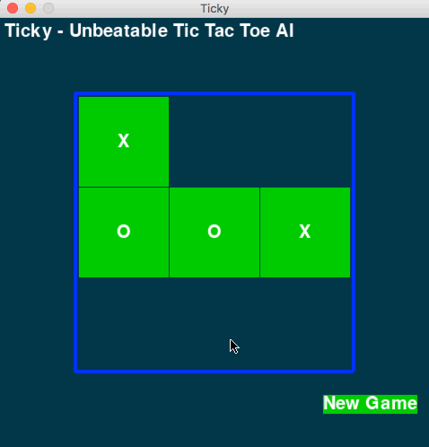

# Ticky

A Tic Tac Toe game, implemented in python, pygame. It includes a unbeatable computer AI. Have a Fun!

**If you like it, PLEASE give it a star, Thanks!**

### Require

You should have `pygame` module installed

### Usage

```bash
git clone https://github.com/memoiry/Ticky
cd Ticky
python ticky.py
```

### Demo



### Minimax Algorithm

The minimax algorithm is a decision rule used for two-player game. The concept of minimax algorithm is to simulate all posible move of both players and then make the best decision.

### Reference

[Tic Tac Toe: Understanding The Minimax Algorithm](http://neverstopbuilding.com/minimax)

[Minimax with Alpha Beta Pruning](http://web.cs.ucla.edu/~rosen/161/notes/alphabeta.html)

